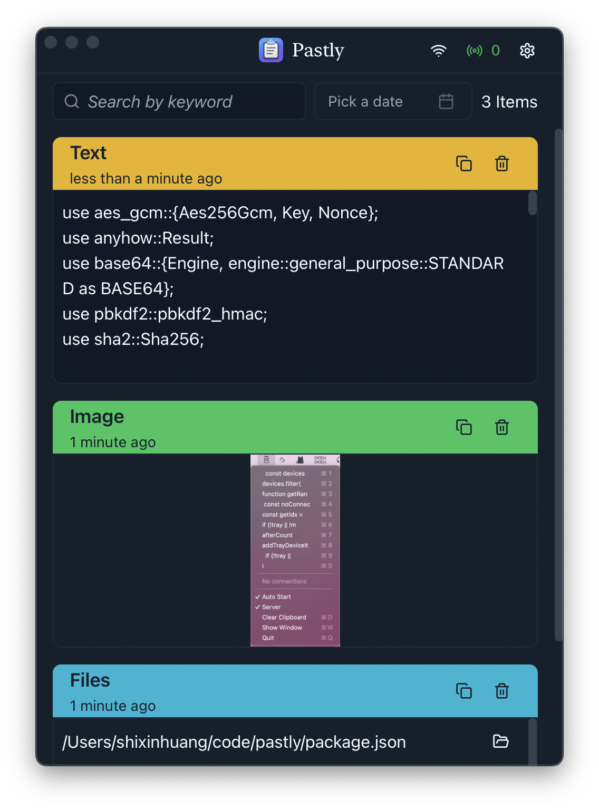
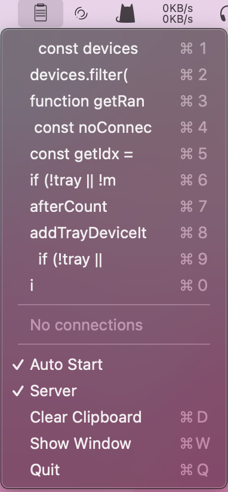

<h1 align="center">
  
  <br>
  <a href="https://github.com/shixinhuang99/pastly">Pastly</a>
  <br>
</h1>

<h3 align="center">
  Clipboard manager with cross-device sync via local network
</h3>

### Preview

| Light                             | Dark                             |
| --------------------------------- | -------------------------------- |
|  |  |

### Installation

[Check out latest release](https://github.com/shixinhuang99/pastly/releases)

### Features

- Supports macOS, Windows and Linux
  > For Linux, only tested on Ubuntu (X11) and only built as a deb package
- Supports text, images, and files
  > Files not supported on Linux, but copied file paths are recorded as text
- Syncs across devices via local network(for example, under the same Wi-Fi network), with automatic device discovery and connection, can be enabled or disabled at any time
  > Allows multiple devices, only syncs text and images
- Supports device pairing via PIN code
- Encrypts synced clipboard content using keys generated from the PIN
- Supports auto-start and system tray
- Supports light mode and dark mode
- Supports multiple languages
  > Currently only supports English and Simplified Chinese
- Supports filtering by keyword and date

### Note

Since it involves networking, the first time the server is started, it will request network permissions.

### Other screenshots

- Tray on macOS



### Development

requirements:

- rust stable
- node 22
- pnpm

packages required for Linux (Ubuntu 24.04 for instance):

```sh
sudo apt install libglib2.0-dev \
  libgtk-3-dev \
  libsoup-3.0-dev \
  libjavascriptcoregtk-4.1-dev \
  libwebkit2gtk-4.1-dev \
  libxdo-dev
```

run:

```sh
pnpm i
cargo build
node --run run
```
